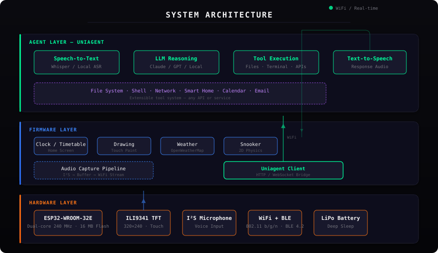
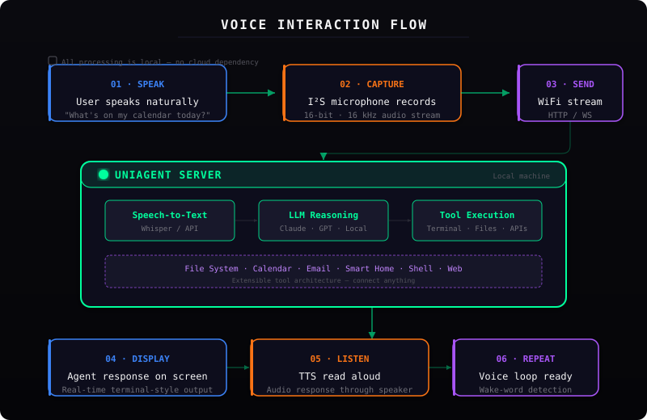

# Agentic Smartwatch

**Wearable voice interface for AI agents.** An open-hardware, 3D-printed wrist computer purpose-built to communicate with [Uniagent](https://github.com/joshy/Uniagent) — speak naturally, get answers, execute tools, all from your wrist.


---

## Overview

The Agentic Smartwatch is a complete wearable computing platform designed to be the physical interface for your personal AI agent. It captures voice input via an onboard I²S microphone, streams it over WiFi to Uniagent running on your local machine, and displays agent responses in real-time on a vivid 2.4-inch TFT screen.

| | |
|---|---|
| **Voice-first interaction** | Hold to talk, speak naturally, get spoken and on-screen responses |
| **Uniagent native** | Built to pair directly with the Uniagent agent framework — speech-to-text, LLM reasoning, tool execution, and text-to-speech |
| **Fully open hardware** | 3D-printable enclosure, custom PCB design, ESP32-based — everything is open |
| **Extensible firmware** | Modular app architecture, WiFi/HTTP client, touch interface — extend without recompiling |

---

## Architecture



The system is split into three layers:

### Hardware Layer
- **ESP32-WROOM-32E** — dual-core 240 MHz, 16 MB flash
- **ILI9341 TFT** — 320×240, 16-bit colour, with resistive touch
- **I²S MEMS microphone** — 16 kHz voice capture
- **WiFi + BLE** — 802.11 b/g/n, Bluetooth 4.2
- **LiPo battery** — with deep sleep for multi-day runtime

### Firmware Layer
- **App system** — Clock/timetable, drawing, weather, snooker physics sim, and the Uniagent voice client
- **Audio pipeline** — I²S capture → buffer → real-time WiFi streaming
- **Uniagent client** — HTTP/WebSocket bridge to your local agent server

### Agent Layer (Uniagent)
- **Speech-to-Text** — Whisper or local ASR
- **LLM Reasoning** — Claude, GPT, or local models
- **Tool Execution** — Terminal, file system, APIs, smart home, calendar, email — anything
- **Text-to-Speech** — Spoken responses played through the watch speaker

---

## Voice Interaction Flow



1. **Speak** — User speaks naturally ("What's on my calendar today?")
2. **Capture** — I²S microphone records 16-bit, 16 kHz audio
3. **Send** — Audio streamed over WiFi to Uniagent on your local machine
4. **Process** — Uniagent transcribes, reasons, and executes tools
5. **Respond** — Response displayed on watch screen and spoken aloud
6. **Loop** — Ready for the next voice command

---

## Technical Specifications

| Category | Detail |
|----------|--------|
| **SoC** | ESP32-WROOM-32E, dual-core Xtensa LX6 @ 240 MHz |
| **Flash** | 16 MB SPI flash |
| **PSRAM** | Optional, supported by ESP32 |
| **Display** | ILI9341 TFT, 320×240, 16-bit RGB565, SPI, 2.4" diagonal |
| **Touch** | XPT2046 resistive touch controller, SPI |
| **Microphone** | I²S MEMS (INMP441 compatible), 16 kHz sampling |
| **Audio output** | Piezo buzzer / small speaker via LEDC PWM |
| **Connectivity** | WiFi 802.11 b/g/n (2.4 GHz), Bluetooth 4.2 BLE |
| **Battery** | Single-cell LiPo (3.7 V), charged via USB |
| **Power management** | ESP32 light sleep, wake-on-button, wake-on-timer |
| **Enclosure** | 3D printed PLA/PETG (STL included) |
| **Firmware** | Arduino framework via PlatformIO, C++17 |
| **Agent protocol** | HTTP / WebSocket to local Uniagent server |

### Pin Mapping

| Peripheral | ESP32 GPIO | Notes |
|------------|------------|-------|
| TFT CS | GPIO14 | |
| TFT DC | GPIO12 | See strapping pin note below |
| TFT MOSI | GPIO27 | |
| TFT SCK | GPIO13 | |
| TFT MISO | GPIO25 | |
| TFT Backlight | GPIO10 | PWM-capable |
| Touch CS | GPIO3 | XPT2046 |
| Microphone | I²S interface | INMP441 |
| Buzzer | GPIO7 | LEDC PWM |
| Battery ADC | GPIO1 | Voltage divider |
| Wake button | GPIO2 | INPUT_PULLUP, wake from deep sleep |

> **Note on GPIO12:** This is the VDD_SDIO strapping pin. If held high at boot, the ESP32's internal flash runs at 1.8 V and stops responding. The current firmware works with careful power sequencing, but moving TFT_DC to GPIO26 or GPIO33 is recommended for production builds.

---

## Hardware Build

### Bill of Materials

| Component | Recommended Part | Notes |
|-----------|-----------------|-------|
| Dev board | ESP32-WROOM-32E (16 MB) | USB-C preferred |
| Display | ILI9341 2.4" TFT + Touch | 320×240, includes XPT2046 |
| Microphone | INMP441 I²S MEMS | Breakout board |
| Battery | 1200–2000 mAh LiPo | JST connector |
| Charger | TP4056 module | Micro-USB or USB-C |
| Enclosure | `WatchBaseMk3.stl` | PLA or PETG, 0.2 mm layer |
| Strap | 22 mm quick-release | Perforated, any colour |
| Passive | 100–470 µF electrolytic + 1 µF ceramic | Power rail stability (see FIXES.md) |

### 3D Printed Enclosure


The STL file (`WatchBaseMk3.stl`) is included in the repository. Print in PLA or PETG with standard 0.2 mm layer height. The enclosure accepts a 22 mm watch strap and has mounts for the ESP32, display, and battery.

### Assembly


---

## Firmware

### Built-in Applications

| App | Description |
|-----|-------------|
| **Home Screen** | 24-hour clock, fortnightly school timetable, WiFi status, battery voltage |
| **Drawing** | Touch-based finger painting with 5 colours |
| **Weather** | Live temperature and sunset via OpenWeatherMap API |
| **Snooker** | 2D physics simulation with elastic collisions |
| **Uniagent Voice** | Voice capture and streaming to Uniagent (in development) |

### Build & Flash

```bash
# Prerequisites: PlatformIO (CLI or VS Code extension)

# Clone
git clone https://github.com/joshy/AgenticSmartwatch.git
cd AgenticSmartwatch

# Build
pio run

# Upload (hold BOOT on ESP32, then press EN)
pio run -t upload

# Monitor
pio device monitor -b 115200
```

### Configuration

1. Create `src/secret.h` from the provided placeholder with your WiFi credentials:

```cpp
WiFiConfig WiFiConfigs[] = {
  {"your-ssid", "your-password"}
};
```

2. Set the Uniagent server address in the firmware to point to your local machine.

3. Adjust `timeToSleep` in `main.cpp` to balance responsiveness vs. battery life.

---

## Project Structure

```
AgenticSmartwatch/
├── images/                      # Photos and diagrams
│   ├── architecture.svg         # System architecture diagram
│   ├── voice-flow.svg           # Voice interaction flow
│   ├── watch_assembled.jpg      # Fully assembled watch
│   ├── watch_enclosure.jpg      # 3D printed enclosure
│   ├── watch_display_module.jpg # Display module
│   ├── watch_electronics.jpg    # Internal electronics
│   └── watch_running.jpg        # Live firmware on screen
├── src/
│   ├── main.cpp                 # Complete firmware
│   ├── secret.h                 # WiFi credentials (gitignored)
│   └── secretPlaceHolder.h      # Template for secret.h
├── WatchBaseMk3.stl             # 3D printable enclosure
├── platformio.ini               # PlatformIO configuration
├── BUGLOG.md                    # Debugging and known issues
├── FIXES.md                     # Hardware fixes and recommendations
└── README.md                    # This file
```

---

## Roadmap

| Feature | Status |
|---------|--------|
| Clock, timetable, WiFi status | ✅ Complete |
| Touch drawing app | ✅ Complete |
| Weather app (OpenWeatherMap) | ✅ Complete |
| 2D physics simulation | ✅ Complete |
| I²S microphone capture | 🔧 In development |
| Uniagent voice streaming | 🔧 In development |
| Agent response display | 🔧 In development |
| Text-to-speech output | 📋 Planned |
| OTA firmware updates | 📋 Planned |
| BLE smartphone notifications | 📋 Planned |

---

## Known Issues

The [BUGLOG](BUGLOG.md) documents hardware debugging during development. Key findings:

| Issue | Root Cause | Status |
|-------|------------|--------|
| NUL boot banners | EN button bounce on marginal power path | Fixed with 1 µF EN→GND cap |
| Pre-setup crashes | 80 MHz flash clock on clone board | Fixed — f_flash forced to 40 MHz |
| Brownout on BLE init | Radio power-up sags 3.3 V rail | Fixed with 470 µF bulk cap |
| GPIO12 strapping | TFT_DC on VDD_SDIO pin | Workaround in place; redesign recommended |

---

## License

Open hardware and firmware. Built for [Uniagent](https://github.com/joshy/Uniagent) — your personal AI agent framework.

© 2026 Joshy McGill
