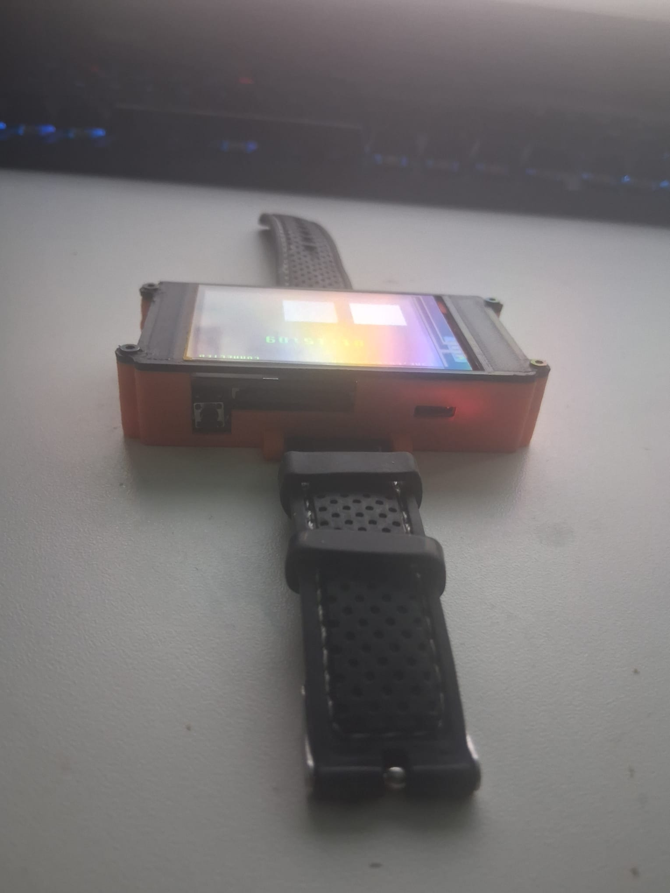
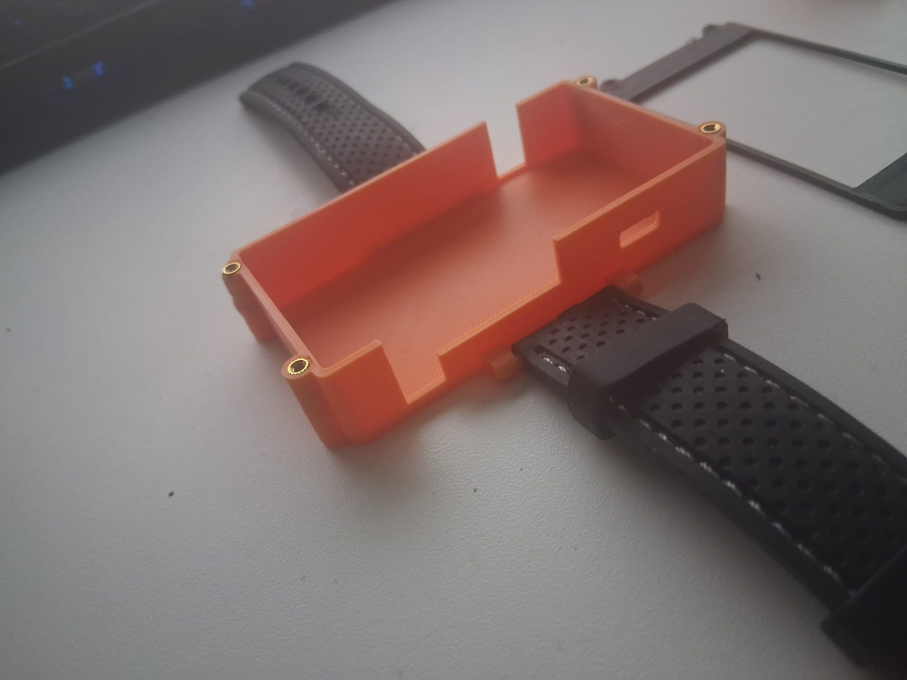
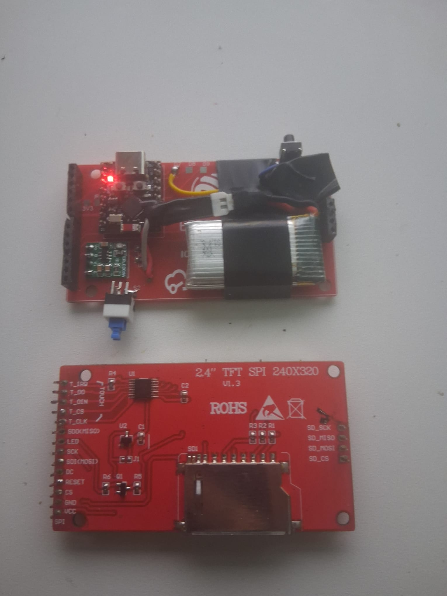
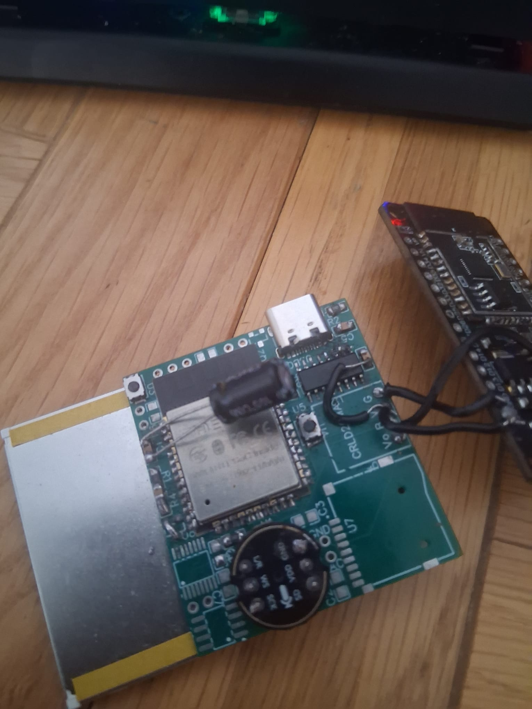
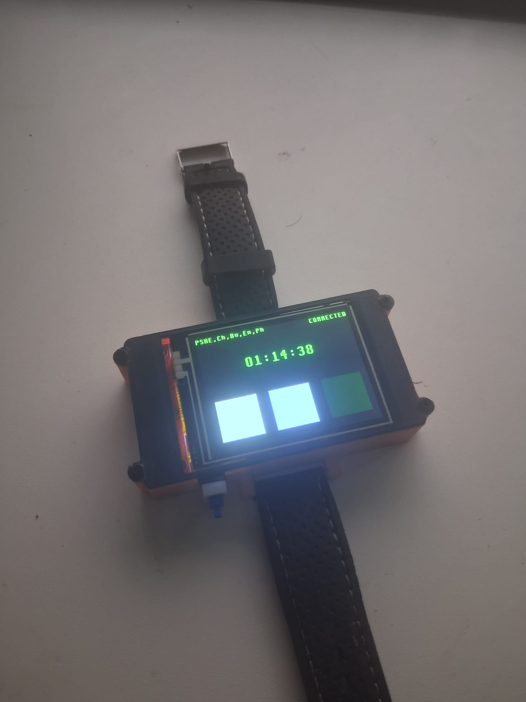
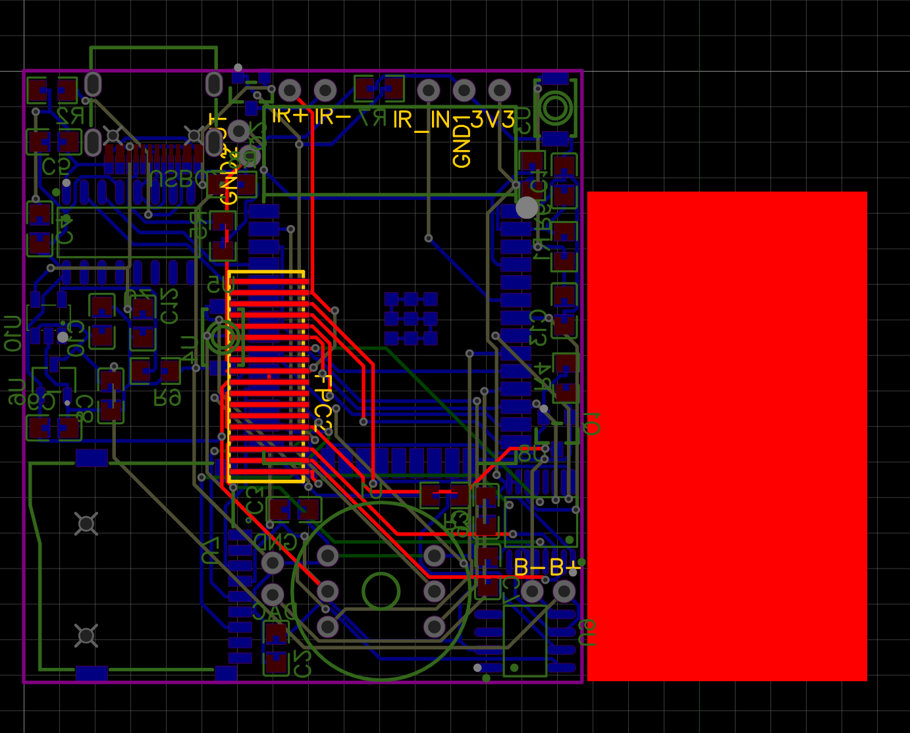

# Agent Watch

**A wrist-mounted interface for AI agent frameworks such as [Uniagent](https://github.com/joshy/Uniagent).** Speak into a 3D-printed smartwatch and get responses from your AI agent on the built-in screen.

<div align="center">

| | |
|:---:|:---:|
|  |  |
|  |  |
|  | |

</div>

## Overview

A wearable that connects to Uniagent over WiFi. The onboard microphone captures voice, sends it to the agent for processing, and displays the response on a 2.4-inch TFT. The entire case is 3D printed, making this fully customisable.

## Hardware

| Component | Detail |
|-----------|--------|
| **MCU** | ESP32-WROOM-32E, 240 MHz dual-core, 16 MB flash |
| **Display** | ILI9341 TFT, 320x240, resistive touch |
| **Microphone** | I2S MEMS |
| **Connectivity** | WiFi 802.11 b/g/n, BLE |
| **Power** | LiPo battery |
| **Enclosure** | 3D printed PLA/PETG (STL included) |

## Build

```bash
git clone https://github.com/JJM8/agent-watch.git
cd agent-watch
pio run
pio run -t upload
```

## Custom PCB

The watch uses a custom-designed PCB (Watch Mk3.4), designed in EasyEDA. The EasyEDA project files are in the [`easyeda/`](easyeda/) directory.

<div align="center">

| |
|:---:|
|  |

</div>
